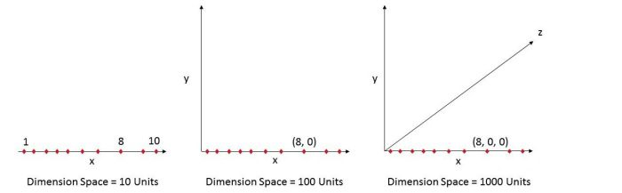
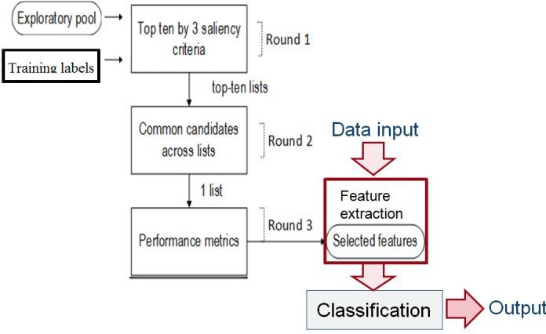
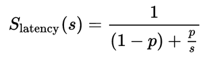
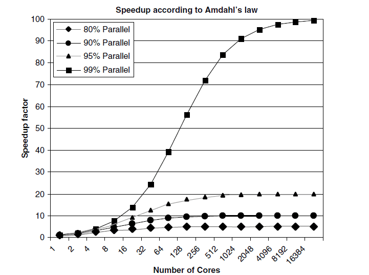
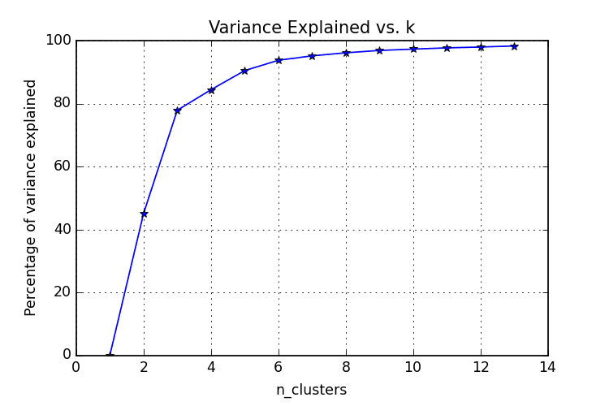
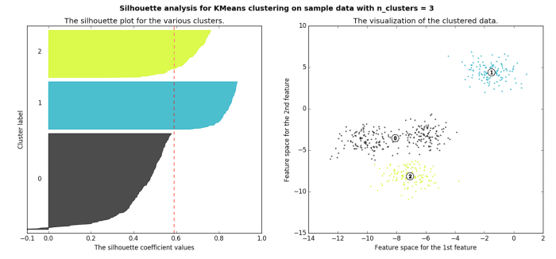

https://www.kdnuggets.com/2017/02/17-data-science-interview-questions-answers-part-2.html

Tags: Algorithms, Data Science, Ensemble Methods, Feature Engineering, Feature Selection, High-dimensional, Interview Questions, Overfitting, Unsupervised Learning

*The second part of 17 new must-know Data Science Interview questions and answers covers overfitting, ensemble methods, feature selection, ground truth in unsupervised learning, the curse of dimensionality, and parallel algorithms.*

By Matthew Mayo, KDnuggets.

Editor's note: See also part 1 of "17 More Must-Know Data Science Interview Questions and Answers". 

https://www.kdnuggets.com/2017/02/17-data-science-interview-questions-answers.html

This is part 2. Here is Part 3.

https://www.kdnuggets.com/2017/03/17-data-science-interview-questions-answers-part-3.html

This post answers questions:

- Q7. What is overfitting and how to avoid it?

- Q8. What is the curse of dimensionality?

- Q9. How can you determine which features are the most important in your model?

- Q10. When can parallelism make your algorithms run faster? When could it make your algorithms run slower?

- Q11. What is the idea behind ensemble learning?

- Q12. In unsupervised learning, if a ground truth about a dataset is unknown, how can we determine the most useful number of clusters to be?

## Q7. What is overfitting and how to avoid it?
 
Gregory Piatetsky answers:  

(Note: this is a revised version of the answer given in "21 Must-Know Data Science Interview Questions and Answers, part 2")

https://www.kdnuggets.com/2016/02/21-data-science-interview-questions-answers-part2.html

Overfitting is when you build a predictive model that fits the data "too closely",  so that it captures the random noise in the data rather than true patterns.

https://www.kdnuggets.com/tag/overfitting

As a result, the model predictions will be wrong when applied to new data.

We frequently hear about studies that report unusual results (especially if you listen to "Wait Wait Don't Tell Me") , or see findings like "an orange used car is least likely to be a lemon",  or learn that studies overturn previous established findings (eggs are no longer bad for you).

https://www.kdnuggets.com/2017/01/siegel-data-science-avoiding-prediction-pitfall.html

Many such studies produce questionable results that cannot be repeated.

This is a big problem, especially in social sciences or medicine, when researchers  frequently commit the cardinal sin of Data Science - Overfitting the data.

https://www.kdnuggets.com/tag/overfitting

The researchers test too many hypotheses without proper statistical control, until they happen to find something interesting. Then they report it.  Not surprisingly, next time the effect (which was partly due to chance) will be much smaller or absent.

These flaws of research practices were identified and reported by John P. A. Ioannidis in his landmark paper "Why Most Published Research Findings Are False" (PLoS Medicine, 2005). 

http://www.plosmedicine.org/article/info%3Adoi%2F10.1371%2Fjournal.pmed.0020124

Ioannidis found that very often either the results were exaggerated or the findings could not be replicated. In his paper, he presented statistical evidence that indeed most claimed research findings are false!

Ioannidis noted that in order for a research finding to be reliable, it should have:

- Large sample size and with large effects

- Greater number of and lesser selection of tested relationship

- Greater flexibility in designs, definitions, outcomes, and analytical modes

- Minimal bias due to financial and other factors (including popularity of that scientific field)

Unfortunately, too often these rules were violated, producing spurious results, such as S&P 500 index strongly correlated to production of butter in Bangladesh, 

https://www.kdnuggets.com/2016/02/21-data-science-interview-questions-answers-part2.html

or US spending on science, space and technology correlated with suicides by hanging, strangulation, and suffocation 

{width=100%}

(Source: Tylervigen.com)

http://tylervigen.com/spurious-correlations

See more strange and spurious findings at Spurious correlations by Tyler Vigen 

http://www.tylervigen.com/discover

or discover them by yourself using tools such as Google correlate:

https://www.google.com/trends/correlate/

Several methods can be used to avoid "overfitting" the data:

- Try to find the simplest possible hypothesis

- Regularization (adding a penalty for complexity)

https://en.wikipedia.org/wiki/Regularization_%28mathematics%29

- Randomization Testing (randomize the class variable, try your method on this data - if it find the same strong results, something is wrong)

https://www.kdnuggets.com/2014/02/3-ways-to-test-accuracy-your-predictive-models.html

- Nested cross-validation  (do feature selection on one level, then run entire method in cross-validation on outer level)

- Adjusting the False Discovery Rate

https://en.wikipedia.org/wiki/False_discovery_rate

- Using the reusable holdout method - a breakthrough approach proposed in 2015

https://www.kdnuggets.com/2015/08/feldman-avoid-overfitting-holdout-adaptive-data-analysis.html

Good data science is on the leading edge of scientific understanding of the world, and it is data scientists responsibility to avoid overfitting data and educate the public and the media on the dangers of bad data analysis.

See also:

- 4 Reasons Your Machine Learning Model is Wrong (and How to Fix It)

https://www.kdnuggets.com/2016/12/4-reasons-machine-learning-model-wrong.html

- When Good Advice Goes Bad

https://www.kdnuggets.com/2016/03/when-good-advice-goes-bad.html

- The Cardinal Sin of Data Mining and Data Science: Overfitting

https://www.kdnuggets.com/2014/06/cardinal-sin-data-mining-data-science.html

- Big Idea To Avoid Overfitting: Reusable Holdout to Preserve Validity in Adaptive Data Analysis

https://www.kdnuggets.com/2015/08/feldman-avoid-overfitting-holdout-adaptive-data-analysis.html

- Overcoming Overfitting with the reusable holdout: Preserving validity in adaptive data analysis

https://www.kdnuggets.com/2015/08/reusable-holdout-preserving-validity-adaptive-data-analysis.html

- 11 Clever Methods of Overfitting and how to avoid them

https://www.kdnuggets.com/2015/01/clever-methods-overfitting-avoid.html

## Q8. What is the curse of dimensionality?
 
Prasad Pore answers:

> As the number of features or dimensions grows, the amount of data we need to generalize accurately grows exponentially. - Charles Isbell, Professor and Senior Associate Dean, School of Interactive Computing, Georgia Tech

Let’s take an example below. Fig. 1 (a) shows 10 data points in one dimension i.e. there is only one feature in the data set. It can be easily represented on a line with only 10 values, x=1, 2, 3... 10.

But if we add one more feature, same data will be represented in 2 dimensions (Fig.1 (b)) causing increase in dimension space to 10\*10 =100. And again if we add 3rd feature, dimension space will increase to 10\*10\*10 = 1000. As dimensions grows, dimensions space increases exponentially:

10^1 = 10

10^2 = 100

10^3 = 1000 and so on...

{width=100%}

**n-dimensional space comparison**

This exponential growth in data causes high sparsity in the data set and unnecessarily increases storage space and processing time for the particular modelling algorithm. Think of image recognition problem of high resolution images 1280 × 720 = 921,600 pixels i.e. 921600 dimensions. OMG. And that’s why it’s called "Curse of Dimensionality":

https://www.kdnuggets.com/?s=curse+of+dimensionality

Value added by additional dimension is much smaller compared to overhead it adds to the algorithm.

Bottom line is, the data that can be represented using 10 space units of one true dimension, needs 1000 space units after adding 2 more dimensions just because we observed these dimensions during the experiment. The true dimension means the dimension which accurately generalize the data and observed dimensions means whatever other dimensions we consider in dataset which may or may not contribute to accurately generalize the data.

## Q9. How can you determine which features are the most important in your model?
 
Thuy Pham answers:

In applied machine learning, success depends significantly on the quality of data representation (features).  Highly correlated features can make learning/sorting steps in the classification module easy. Conversely if label classes are a very complex function of the features, it can be impossible to build a good model [Dom 2012]. Thus a so-called feature engineering, a process of transforming data into features that are most relevant to the problem, is often needed.

https://www.kdnuggets.com/tags/feature-engineering

A feature selection scheme often involves techniques to automatically select salient features from a large exploratory feature pool. 

https://www.kdnuggets.com/tag/feature-selection

Redundant and irrelevant features are well known to cause poor accuracy so discarding these features should be the first task. The relevance is often scored using mutual information calculation. Furthermore, input features should thus offer a high level of discrimination between classes. The separability of features can be measured by distance  or variance ratio between classes. One recent work [Pham 2016] proposed a systematic voting based feature selection that is a data-driven approach incorporating above criteria. This can be used as a common framework for a wide class of problems.

{width=100%}

**A data-driven feature selection approach incorporating several saliency criteria [Pham 2016]**

Another approach is penalizing on the features that are not very important (e.g., yield a high error metric) when using regularization  methods like Lasso or Ridge.

References:

- [Dom 2012] P. Domingos. A few useful things to know about machine learning. Communications of the ACM, 55(10):78–87, 2012. 2.4

- [Pham 2016] T. T. Pham, C. Thamrin, P. D. Robinson, and P. H. W. Leong. Respiratory artefact removal in forced oscillation measurements: A machine learning approach. Biomedical Engineering, IEEE Transactions on, accepted, 2016.

## Q10. When can parallelism make your algorithms run faster? When could it make your algorithms run slower?
 
Anmol Rajpurohit answers:

Parallelism is a good idea when the task can be divided into sub-tasks that can be executed independent of each other without communication or shared resources. Even then, efficient implementation is key to achieving the benefits of parallelization. In real-life, most of the programs have some sections that need to be executed in serialized fashion, and the parallelizable sub-tasks need some kind of synchronization or data transfer. Thus, it is hard to predict whether parallelization will actually make the algorithm run faster (than the serialized approach).

https://www.kdnuggets.com/tag/algorithms

Parallelism would always have overhead compared to the compute cycles required to complete the task sequentially. At the minimum, this overhead will comprise of dividing the task into sub-tasks and compiling together the results of sub-tasks.

The performance of parallelism against sequential computing is largely determined by how the time consumed by this overhead compares to the time saved due to parallelization.

Note: The overhead associated with parallelism is not just limited to the run-time of code, but also includes the extra time required for coding and debugging (parallelism versus sequential code).

A widely-known theoretical approach to assessing the benefit of parallelization is Amdahl’s law, which gives the following formula to measure the speedup of running sub-tasks in parallel (over different processors) versus running them sequentially (on a single processor):

{width=50%}

where:

- `Slatency` is the theoretical speedup of the execution of the whole task

- `s` is the speedup of the part of the task that benefits from improved system resources

- `p` is the proportion of execution time that the part benefiting from improved resources originally occupied

To understand the implication of Amdahl’s Law, look at the following figure that illustrates the theoretical speedup against an increasing number of processor cores, for tasks with different level of achievable parallelization:

{width=50%}

**Speedup by number of cores**

It is important to note that not every program can be effectively parallelized. Rather, very few programs will scale with perfect speedups because of the limitations due to sequential portions, inter-communication costs, etc. Usually, large data sets form a compelling case for parallelization. However, it should not be assumed that parallelization would lead to performance benefits. Rather, the performance of parallelism and sequential should be compared on a sub-set of the problem, before investing effort into parallelization.

## Q11. What is the idea behind ensemble learning?
 
Prasad Pore answers:

> In statistics and machine learning, ensemble methods use multiple learning algorithms to obtain better predictive performance than could be obtained from any of the constituent learning algorithms alone." – Wikipedia.

https://en.wikipedia.org/wiki/Statistics

https://en.wikipedia.org/wiki/Machine_learning

https://en.wikipedia.org/wiki/Predictive_inference

Imagine you are playing the game “Who wants to be millionaire?” and reached up to last question of 1 million dollars. You have no clue about the question, but you have audience poll and phone a friend life lines. Thank God. At this stage you don’t want to take any risk, so what will you do to get sure-shot right answer to become millionaire?

You will use both life lines, isn’t it? Let’s say 70% audience is saying right answer is D and your friend is also saying the right answer is D with 90% confidence because he is an expert in the area of the question. Use of both life lines gives you  an average 80% confidence that D is correct and gets you closer to becoming a millionaire.

This is the approach of ensemble methods.

https://www.kdnuggets.com/tag/ensemble-methods

The famous Netflix Prize competition took almost 3 years before the goal of 10% improvement was reached.

https://en.wikipedia.org/wiki/Netflix_Prize

https://www.kdnuggets.com/news/2009/n14/1i.html

The winners used gradient boosted decision trees to combine over 500 models.

http://blog.echen.me/2011/10/24/winning-the-netflix-prize-a-summary/

In ensemble methods, more diverse the models used, more robust will be the ultimate result.

Different models used in ensemble improves overall variance from difference in population, difference in hypothesis generated, difference in algorithms used and difference in parametrization. There are main 3 widely used ensembles techniques:

- Bagging

- Boosting 

https://www.kdnuggets.com/tag/boosting

- Stacking

So if you have different models built for same data and same response variable, you can use one of the above methods to build ensemble model. As every model used in the ensemble has its own performance measures, some of the models may perform better than ultimate ensemble model and some of them may perform poorer than or equal to ensemble model. But overall the ensemble methods will improve overall accuracy and stability of the model, although at the expense of model understandability.

For more on ensemble methods see:

- Ensemble Methods: Elegant Techniques to Produce Improved Machine Learning Results

https://www.kdnuggets.com/2016/02/ensemble-methods-techniques-produce-improved-machine-learning.html

- Data Science Basics: An Introduction to Ensemble Learners

https://www.kdnuggets.com/2016/11/data-science-basics-intro-ensemble-learners.html

## Q12. In unsupervised learning, if a ground truth about a dataset is unknown, how can we determine the most useful number of clusters to be?
 
Matthew Mayo answers:

With supervised learning, the number of classes in a particular set of data is known outright, since each data instance in labeled as a member of a particular existent class. In the worst case, we can scan the class attribute and count up the number of unique entries which exist.

With unsupervised learning, the idea of class attributes and explicit class membership does not exist; in fact, one of the dominant forms of unsupervised learning - data clustering - aims to approximate class membership by minimizing interclass instance similarity and maximizing intraclass similarity. 

https://www.kdnuggets.com/tag/unsupervised-learning

A major drawback with clustering can be the requirement to provide the number of classes which exist in the unlabeled dataset at the onset, in some form or another. If we are lucky, we may know the data’s ground truth - the actual number of classes - beforehand. However, this is not always the case, for numerous reasons, one of which being that there may actually be no defined number of classes (and hence, clusters) in the data, with the whole point of the unsupervised learning task being to survey the data and attempt to impose some meaningful structure of optimal cluster and class numbers upon it.

Without knowing the ground truth of a dataset, then, how do we know what the optimal number of data clusters are? As one may expect, there are actually numerous methods to go about answering this question. We will have a look at 2 particular popular methods for attempting to answer this question: the elbow method and the silhouette method.

### The Elbow Method

The elbow method is often the best place to state, and is especially useful due to its ease of explanation and verification via visualization. The elbow method is interested in explaining variance as a function of cluster numbers (the k in k-means). By plotting the percentage of variance explained against k, the first N clusters should add significant information, explaining variance; yet, some eventual value of k will result in a much less significant gain in information, and it is at this point that the graph will provide a noticeable angle. This angle will be the optimal number of clusters, from the perspective of the elbow method,

It should be self-evident that, in order to plot this variance against varying numbers of clusters, varying numbers of clusters must be tested. Successive complete iterations of the clustering method must be undertaken, after which the results can be plotted and compared.

{width=50%}

**Elbow method**

Image source: https://elf11.github.io/2015/08/18/Kmeans-analysis.html

### The Silhouette Method

The silhouette method measures the similarity of an object to its own cluster -- called cohesion -- when compared to other clusters -- called separation. The silhouette value is the means for this comparison, which is a value of the range [-1, 1]; a value close to 1 indicates a close relationship with objects in its own cluster, while a value close to -1 indicates the opposite. A clustered set of data in a model producing mostly high silhouette values is likely an acceptable and appropriate model.

{width=100%}

**Silhouette method**

Image source: http://scikit-learn.org/stable/auto_examples/cluster/plot_kmeans_silhouette_analysis.html

Read more on the silhouette method here:

http://scikit-learn.org/stable/auto_examples/cluster/plot_kmeans_silhouette_analysis.html

Find the specifics on computing a silhouette value here:

https://en.wikipedia.org/wiki/Silhouette_(clustering)

## Related:

- 17 More Must-Know Data Science Interview Questions and Answers

https://www.kdnuggets.com/2017/02/17-data-science-interview-questions-answers.html

- 17 More Must-Know Data Science Interview Questions and Answers, part 3

https://www.kdnuggets.com/2017/03/17-data-science-interview-questions-answers-part3.html

- 21 Must-Know Data Science Interview Questions and Answers

https://www.kdnuggets.com/2016/02/21-data-science-interview-questions-answers.html

- 21 Must-Know Data Science Interview Questions and Answers, part 2

https://www.kdnuggets.com/2016/02/21-data-science-interview-questions-answers-part2.html
