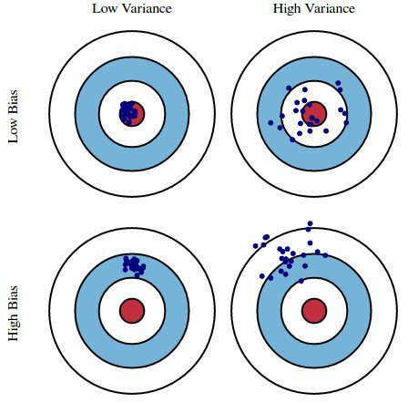
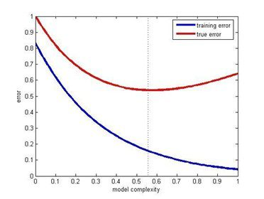

https://www.kdnuggets.com/2017/02/17-data-science-interview-questions-answers.html

Tags: Anomaly Detection, Bias, Classification, Data Science, Donald Trump, Interview Questions, Outliers, Overfitting, Variance

*17 new must-know Data Science Interview questions and answers include lessons from failure to predict 2016 US Presidential election and Super Bowl LI comeback, understanding bias and variance, why fewer predictors might be better, and how to make a model more robust to outliers.*
 
By Gregory Piatetsky, KDnuggets.

The post "21 Must-Know Data Science Interview Questions and Answers" was the most viewed post of 2016, with over 250,000 page views:

https://www.kdnuggets.com/2016/02/21-data-science-interview-questions-answers.html

For 2017, KDnuggets Editors bring you 17 more new and important Data Science Interview Questions and Answers. Because some of the answers are quite lengthy, we will publish them in 3 parts over 3 weeks. This is part 1, which answers the 6 questions below. Here is part 2 and part 3:

https://www.kdnuggets.com/2017/02/17-data-science-interview-questions-answers-part-2.html

https://www.kdnuggets.com/2017/03/17-data-science-interview-questions-answers-part-3.html

This post answers questions:

- Q1. What are Data Science lessons from failure to predict 2016 US Presidential election (and from Super Bowl LI comeback)

- Q2. What problems arise if the distribution of the new (unseen) test data is significantly different than the distribution of the training data?

- Q3. What are bias and variance, and what are their relation to modeling data?

- Q4. Why might it be preferable to include fewer predictors over many?

- Q5. What error metric would you use to evaluate how good a binary classifier is? What if the classes are imbalanced? What if there are more than 2 groups?

- Q6. What are some ways I can make my model more robust to outliers?

## Q1. What are Data Science lessons from failure to predict 2016 US Presidential election (and from Super Bowl LI comeback)

Gregory Piatetsky answers:

{width=50%}

Just before the Nov 8, 2016 election, most pollsters gave Hillary Clinton an edge of ~3% in popular vote and 70-95% chance of victory in electoral college. Nate Silver's FiveThirtyEight had the highest chances of Trump Victory at ~30%, while New York Times Upshot and Princeton Election Consortium estimated only ~15%, and other pollsters like Huffington Post gave Trump only 2% chance of victory. Still, Trump won. So what are the lessons for Data Scientists?

To make a statistically valid prediction we need

1. enough historical data

2. assumption that past events are sufficiently similar to current event we are trying to predict

Events can placed on the scale from deterministic (2+2 will always equal to 4) to strongly predictable (e.g. orbits of planets and moons, avg. number of heads when tossing a fair coin) to weakly predictable (e.g. elections and sporting events) to random (e.g. honest lottery).

If we toss a fair coin 100 million times, we have the expected number of heads (mean) as 50 million, the standard deviation =10,000 (using formula 0.5 * SQRT(N)), and we can predict that 99.7% of the time the expected number of heads will be within 3 standard deviations of the mean.

https://en.wikipedia.org/wiki/68%E2%80%9395%E2%80%9399.7_rule

But using polling to predict the votes of 100 million people is much more difficult. Pollsters need to get a representative sample, estimate the likelihood of a person actually voting, make many justified and unjustified assumptions, and avoid following their conscious and unconscious biases.

In the case of US Presidential election, correct prediction is even more difficult because of the antiquated Electoral college system when each state (except for Maine and Nebraska) awards the winner all its votes in the electoral college, and the need to poll and predict results for each state separately.

The chart below shows that in 2016 US presidential elections pollsters were off the mark in many states. They mostly underestimated the Trump vote, especially in 3 critical states of Michigan, Wisconsin, and Pennsylvania which all flipped to Trump.

{width=100%}

**US Elections 2016 Poll Shift, according to 538**

Source: @NateSilver538 tweet, Nov 9, 2016.

A few statisticians like Salil Mehta @salilstatistics were warning about unreliability of polls, 

https://twitter.com/salilstatistics/status/796248050851139584

and David Wasserman of 538 actually described this scenario in Sep 2016 "How Trump Could Win The White House While Losing The Popular Vote", 

https://fivethirtyeight.com/features/how-trump-could-win-the-white-house-while-losing-the-popular-vote/?ex_cid=story-twitter

but most pollsters were way off.

So a good lesson for Data Scientists is to question their assumptions and to be very skeptical when predicting a weakly predictable event, especially when based on human behavior.

Other important lessons are

- Examine data quality
    + in this election polls were not reaching all likely voters

- Beware of your own biases
    + many pollsters were likely Clinton supporters and did not want to question the results that favored their candidate
    + For example, Huffington Post had forecast over 95% chance of Clinton Victory

See also other analyses of 2016 polling failures:

- Wired: "Trump’s Win Isn’t the Death of Data—It Was Flawed All Along"

https://www.wired.com/2016/11/trumps-win-isnt-death-data-flawed-along

- NYTimes: "How Data Failed Us in Calling an Election"

https://www.nytimes.com/2016/11/10/technology/the-data-said-clinton-would-win-why-you-shouldnt-have-believed-it.html

- Datanami: "Six Data Science Lessons from the Epic Polling Failure"

https://www.datanami.com/2016/11/11/data-science-lessons-epic-polling-failure/

- InformationWeek: "Trump's Election: Poll Failures Hold Data Lessons For IT"

http://www.informationweek.com/big-data/big-data-analytics/trumps-election-poll-failures-hold-data-lessons-for-it/d/d-id/1327455

- "Why I Had to Eat a Bug on CNN", by Sam Wang, Princeton, whose Princeton Election Consortium gave Trump 15% to win

https://www.nytimes.com/2016/11/19/opinion/why-i-had-to-eat-a-bug-on-cnn.html?emc=eta1&_r=0

Note: this answer is based on a previous KDnuggets post: 

https://www.kdnuggets.com/2016/11/trump-shows-limits-prediction.html

We had another example of statistically very unlikely event happen in Super Bowl LI on Feb 5, 2017.  After the half time, Atlanta Falcons were leading 21:3 after halftime and 28:9 after 3rd quarter. ESPN estimated Falcons win probability at that time at almost 100%.

{width=100%}

**Super Bowl 2017 win probability**

(reference: Salil Mehta tweet Salil Mehta tweet, Feb 6, 2017)

https://twitter.com/salilstatistics/status/828581183558713344

Never before has a team lost a Super Bowl after holding such advantage.  However, each Super Bowl is different, and this one was turned out to be very different.  Combination of superior skill (Patriots, after all, were favorites before the game) and luck (e.g. a very lucky catch by Julian Edelman in 4th quarter, Patriots winning coin toss in overtime) gave victory to Pats.

This Super Bowl was another good lesson for Data Scientists of danger of having too much confidence when predicting weakly predictable events. You need to understand the risk factors when dealing with such events, and try to avoid using probabilities, or if you have to use numbers, have a wide confidence range.

Finally, if the odds seem to be against you but the event is only weakly predictable, go ahead and do your best - sometimes you will be able to beat the odds.

## Q2. What problems arise if the distribution of the new (unseen) test data is significantly different than the distribution of the training data?

Gregory Piatetsky and Thuy Pham answer:

The main problem is that the predictions will be wrong !

If the new test data is sufficiently different in key parameters of the prediction model from the training data, then predictive model is no longer valid.

The main reasons this can happen are sample selection bias, population drift, or non-stationary environment.

### Sample selection bias

Here the data is static, but the training examples have been obtained through a biased method, such as non-uniform selection or non-random split of data into train and test.

If you have a large static dataset, then you should randomly split it into train/test data, and the distribution of test data should be similar to training data.

### Covariate shift, a.k.a. population drift

Here the data is not static, with one population used as a training data, and another population used for testing.

{width=100%}

(Figure from http://iwann.ugr.es/2011/pdf/InvitedTalk-FHerrera-IWANN11.pdf).

Sometimes the training data and test data are derived via different processes - eg a drug tested on one population is given to a new population that may have significant differences. As a result, a classifier based on training data will perform poorly.

One proposed solution is to apply a statistical test to decide if the probabilities of target classes and key variables used by the classifier are significantly different, and if they are, to retrain the model using new data.

### Non-stationary environments

Training environment is different from the test one, whether it's due to a temporal or a spatial change.

This is similar to case b, but applies to situation when data is not static -  we have a stream of data and we periodically sample it to develop predictive models of future behavior.  This happens in adversarial classification problems, such as spam filtering and network intrusion detection, where spammers and hackers constantly change their behavior in response. Another typical case is customer analytics where customer behavior changes over time.  A telephone company develops a model for predicting customer churn or a credit card company develops a model to predict transaction fraud.  Training data is historical data, while (new) test data is the current data.

Such models periodically need to be retrained and to determine when you can compare the distribution of key variables in the predictive model in the old data (training set) and the new data, and if there is a sufficiently significant difference, the model needs to be retrained.

For a more detailed and technical discussion, see references below.

## References:

[1] Marco Saerens, Patrice Latinne, Christine Decaestecker: Adjusting the Outputs of a Classifier to New a Priori Probabilities: A Simple Procedure. Neural Computation 14(1): 21-41 (2002)

[2] Machine Learning in Non-stationary Environments: Introduction to Covariate Shift Adaptation, Masashi Sugiyama, Motoaki Kawanabe, MIT Press, 2012, ISBN 0262017091, 9780262017091

[3] Quora answer to "What could be some issues if the distribution of the test data is significantly different than the distribution of the training data?"

https://www.quora.com/What-could-be-some-issues-if-the-distribution-of-the-test-data-is-significantly-different-than-the-distribution-of-the-training-data

[4] "Dataset Shift in Classification: Approaches and Problems", Francisco Herrera invited talk, 2011.

http://iwann.ugr.es/2011/pdf/InvitedTalk-FHerrera-IWANN11.pdf

[5] "When Training and Test Sets are Different: Characterising Learning Transfer", Amos Storkey, 2013.

http://homepages.inf.ed.ac.uk/amos/publications/Storkey2009TrainingTestDifferent.pdf

## Q3. What are bias and variance, and what are their relation to modeling data?

Matthew Mayo answers:

Bias is how far removed a model's predictions are from correctness, while variance is the degree to which these predictions vary between model iterations.

{width=100%}

**Bias vs Variance, Image source**

http://scott.fortmann-roe.com/docs/BiasVariance.html

As an example, using a simple flawed Presidential election survey as an example, errors in the survey are then explained through the twin lenses of bias and variance: selecting survey participants from a phonebook is a source of bias; a small sample size is a source of variance.

https://www.kdnuggets.com/2016/08/bias-variance-tradeoff-overview.html

Minimizing total model error relies on the balancing of bias and variance errors. Ideally, models are the result of a collection of unbiased data of low variance. Unfortunately, however, the more complex a model becomes, its tendency is toward less bias but greater variance; therefore an optimal model would need to consider a balance between these 2 properties.

The statistical evaluation method of cross-validation is useful in both demonstrating the importance of this balance, as well as actually searching it out. The number of data folds to use - the value of k in k-fold cross-validation - is an important decision; the lower the value, the higher the bias in the error estimates and the less variance.

{width=100%}

**Bias and variance contributing to total error, Image source**

http://scott.fortmann-roe.com/docs/BiasVariance.html

Conversely, when k is set equal to the number of instances, the error estimate is then very low in bias but has the possibility of high variance.
The most important takeaways are that bias and variance are two sides of an important trade-off when building models, and that even the most routine of statistical evaluation methods are directly reliant upon such a trade-off.

## Q4. Why might it be preferable to include fewer predictors over many?

Anmol Rajpurohit answers:

Here are a few reasons why it might be a better idea to have fewer predictor variables rather than having many of them:

### Redundancy/Irrelevance:

If you are dealing with many predictor variables, then the chances are high that there are hidden relationships between some of them, leading to redundancy. Unless you identify and handle this redundancy (by selecting only the non-redundant predictor variables) in the early phase of data analysis, it can be a huge drag on your succeeding steps.

It is also likely that not all predictor variables are having a considerable impact on the dependent variable(s). You should make sure that the set of predictor variables you select to work on does not have any irrelevant ones – even if you know that data model will take care of them by giving them lower significance.

Note: Redundancy and Irrelevance are two different notions –a relevant feature can be redundant due to the presence of other relevant feature(s).

### Overfitting:

Even when you have a large number of predictor variables with no relationships between any of them, it would still be preferred to work with fewer predictors. The data models with large number of predictors (also referred to as complex models) often suffer from the problem of overfitting, in which case the data model performs great on training data, but performs poorly on test data.

### Productivity:

Let’s say you have a project where there are a large number of predictors and all of them are relevant (i.e. have measurable impact on the dependent variable). So, you would obviously want to work with all of them in order to have a data model with very high success rate. While this approach may sound very enticing, practical considerations (such of amount of data available, storage and compute resources, time taken for completion, etc.) make it nearly impossible.

Thus, even when you have a large number of relevant predictor variables, it is a good idea to work with fewer predictors (shortlisted through feature selection or developed through feature extraction). This is essentially similar to the Pareto principle, which states that for many events, roughly 80% of the effects come from 20% of the causes.

Focusing on those 20% most significant predictor variables will be of great help in building data models with considerable success rate in a reasonable time, without needing non-practical amount of data or other resources.

{width=100%}

**Training error & test error vs model complexity (Source: Posted on Quora by Sergul Aydore)**

https://www.quora.com/Why-might-it-be-preferable-to-include-fewer-predictors-over-many/answer/Serg%C3%BCl-Ayd%C3%B6re

### Understandability:

Models with fewer predictors are way easier to understand and explain. As the data science steps will be performed by humans and the results will be presented (and hopefully, used) by humans, it is important to consider the comprehensive ability of human brain. This is basically a trade-off – you are letting go of some potential benefits to your data model’s success rate, while simultaneously making your data model easier to understand and optimize.

This factor is particularly important if at the end of your project you need to present your results to someone, who is interested in not just high success rate, but also in understanding what is happening “under the hood”.

## Q5. What error metric would you use to evaluate how good a binary classifier is? What if the classes are imbalanced? What if there are more than 2 groups?

Prasad Pore answers:

Binary classification involves classifying the data into two groups, e.g. whether or not a customer buys a particular product or not (Yes/No), based on independent variables such as gender, age, location etc.

As the target variable is not continuous, binary classification model predicts the probability of a target variable to be Yes/No. To evaluate such a model, a metric called the confusion matrix is used, also called the classification or co-incidence matrix. With the help of a confusion matrix, we can calculate important performance measures:

- True Positive Rate (TPR) or Hit Rate or Recall or Sensitivity
    + TP / (TP + FN)

- False Positive Rate (FPR) or False Alarm Rate
    + 1 - Specificity
    + 1 - (TN / (TN + FP))

- Accuracy
    + (TP + TN) / (TP + TN + FP + FN)

- Error Rate
    + 1 – accuracy
    + (FP + FN) / (TP + TN + FP + FN)

- Precision
    + TP / (TP + FP)

- F-measure
    + 2 / ((1/Precision) + (1/Recall))

- Receiver Operating Characteristics (ROC)
    + plot of FPR vs TPR

- Area Under the Curve (AUC)

- Kappa statistics

You can find more details about these measures here "The Best Metric to Measure Accuracy of Classification Models".

https://www.kdnuggets.com/2016/12/best-metric-measure-accuracy-classification-models.html

All of these measures should be used with domain skills and balanced, as, for example, if you only get a higher TPR in predicting patients who don’t have cancer, it will not help at all in diagnosing cancer.

In the same example of cancer diagnosis data, if only 2% or less of the patients have cancer, then this would be a case of class imbalance, as the percentage of cancer patients is very small compared to rest of the population. There are main 2 approaches to handle this issue:

### Use of a cost function: 

In this approach, a cost associated with misclassifying data is evaluated with the help of a cost matrix (similar to the confusion matrix, but more concerned with False Positives and False Negatives). The main aim is to reduce the cost of misclassifying. The cost of a False Negative is always more than the cost of a False Positive, e.g., wrongly predicting a cancer patient to be cancer-free is more dangerous than wrongly predicting a cancer-free patient to have cancer

Total Cost = (Cost of FN)(Count of FN) + (Cost of FP)(Count of FP)

### Use of different sampling methods: 

In this approach, you can use over-sampling, under-sampling, or hybrid sampling. In over-sampling, minority class observations are replicated to balance the data. Replication of observations leading to overfitting, causing good accuracy in training but less accuracy in unseen data. In under-sampling, the majority class observations are removed causing loss of information. It is helpful in reducing processing time and storage, but only useful if you have a large data set.

Find more about class imbalance here:

https://www.kdnuggets.com/2016/08/learning-from-imbalanced-classes.html

If there are multiple classes in the target variable, then a confusion matrix of dimensions equal to the number of classes is formed, and all performance measures can be calculated for each of the classes. This is called a multiclass confusion matrix. e.g. there are 3 classes X, Y, Z in the response variable, so recall for each class will be calculated as below:

Recall_X = TP_X / (TP_X + FN_X)

Recall_Y = TP_Y / (TP_Y + FN_Y)

Recall_Z = TP_Z / (TP_Z + FN_Z)

## Q6. What are some ways I can make my model more robust to outliers?

Thuy Pham answers:

There are several ways to make a model more robust to outliers, from different points of view (data preparation or model building). An outlier in the question and answer is assumed being unwanted, unexpected, or a must-be-wrong value to the human’s knowledge so far (e.g. no one is 200 years old) rather than a rare event which is possible but rare.

Outliers are usually defined in relation to the distribution. Thus outliers could be removed in the pre-processing step (before any learning step), by using standard deviations (for normality) or interquartile ranges (for not normal/unknown) as threshold levels.

{width=100%}

**Outliers. Image source**

Moreover, data transformation (e.g. log transformation) may help if data have a noticeable tail. When outliers related to the sensitivity of the collecting instrument which may not precisely record small values, Winsorization may be useful. This type of transformation (named after Charles P. Winsor (1895–1951)) has the same effect as clipping signals (i.e. replaces extreme data values with less extreme values).  Another option to reduce the influence of outliers is using mean absolute difference rather mean squared error.

For model building, some models are resistant to outliers (e.g. tree-based approaches) or non-parametric tests. 

https://www.quora.com/Why-are-tree-based-models-robust-to-outliers

Similar to the median effect, tree models divide each node into two in each split. Thus, at each split, all data points in a bucket could be equally treated regardless of extreme values they may have. The study [Pham 2016] proposed a detection model that incorporates interquartile information of data to predict outliers of the data.

## References:

[Pham 2016] T. T. Pham, C. Thamrin, P. D. Robinson, and P. H. W. Leong. Respiratory artefact removal in forced oscillation measurements: A machine learning approach. IEEE Transactions on Biomedical Engineering, 2016.

This Quora answer contains further information:

https://www.quora.com/What-are-methods-to-make-a-predictive-model-more-robust-to-outliers

Here is part 2 and part 3 with more answers:

https://www.kdnuggets.com/2017/02/17-data-science-interview-questions-answers-part-2.html

https://www.kdnuggets.com/2017/03/17-data-science-interview-questions-answers-part-3.html

