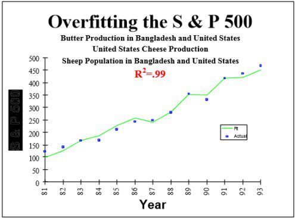
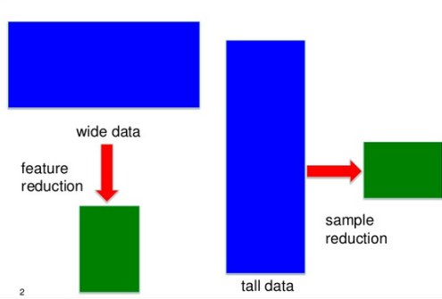
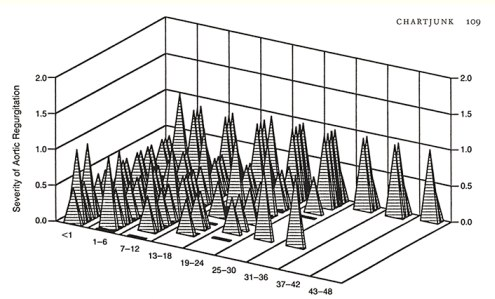
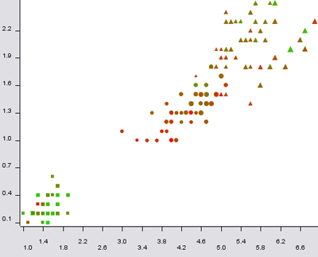
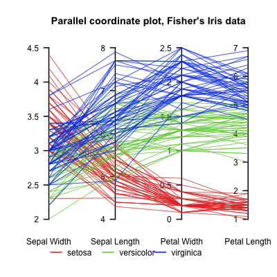

21 Must-Know Data Science Interview Questions and Answers, part 2
================
Robert A. Stevens
2021-12-12

<https://www.kdnuggets.com/2016/02/21-data-science-interview-questions-answers-part2.html>

Tags: Anomaly Detection, Data Science, Data Visualization, Overfitting,
Recommender Systems

*Second part of the answers to 20 Questions to Detect Fake Data
Scientists, including controlling overfitting, experimental design, tall
and wide data, understanding the validity of statistics in the media,
and more.*

By Gregory Piatetsky, KDnuggets.

The post on KDnuggets 20 Questions to Detect Fake Data Scientists has
been very popular - most viewed post of the month.

<https://www.kdnuggets.com/2016/01/20-questions-to-detect-fake-data-scientists.html>

However these questions were lacking answers, so KDnuggets Editors got
together and wrote the answers. Here is part 2 of the answers, starting
with a “bonus” question.

<https://www.kdnuggets.com/2016/02/21-data-science-interview-questions-answers.html>

## Bonus Question: Explain what is overfitting and how would you control for it

This question was not part of the original 20, but probably is the most
important one in distinguishing real data scientists from fake ones.

Answer by Gregory Piatetsky.

Overfitting is finding spurious results that are due to chance and
cannot be reproduced by subsequent studies.

We frequently see newspaper reports about studies that overturn the
previous findings, like eggs are no longer bad for your health, or
saturated fat is not linked to heart disease.

<https://well.blogs.nytimes.com/2014/03/17/study-questions-fat-and-heart-disease-link/>

The problem, in our opinion is that many researchers, especially in
social sciences or medicine, too frequently commit the cardinal sin of
Data Mining - Overfitting the data.

The researchers test too many hypotheses without proper statistical
control, until they happen to find something interesting and report it.
Not surprisingly, next time the effect, which was (at least partly) due
to chance, will be much smaller or absent.

These flaws of research practices were identified and reported by John
P. A. Ioannidis in his landmark paper “Why Most Published Research
Findings Are False” (PLoS Medicine, 2005).

<http://www.plosmedicine.org/article/info%3Adoi%2F10.1371%2Fjournal.pmed.0020124>

Ioannidis found that very often either the results were exaggerated or
the findings could not be replicated. In his paper, he presented
statistical evidence that indeed most claimed research findings are
false.

Ioannidis noted that in order for a research finding to be reliable, it
should have:

-   Large sample size and with large effects

-   Greater number of and lesser selection of tested relationship

-   Greater flexibility in designs, definitions, outcomes, and
    analytical modes

-   Minimal bias due to financial and other factors (including
    popularity of that scientific field)

Unfortunately, too often these rules were violated, producing
irreproducible results. For example, S&P 500 index was found to be
strongly related to Production of butter in Bangladesh (from 19891 to
1993) (here is PDF)

<http://nerdsonwallstreet.typepad.com/my_weblog/files/dataminejune_2000.pdf>

 **S&P
500 correlates to butter in Bangladesh**

See more interesting (and totally spurious) findings which you can
discover yourself using tools such as “Google correlate”

<https://www.google.com/trends/correlate/>

or “Spurious correlations” by Tyler Vigen.

<http://www.tylervigen.com/discover>

Several methods can be used to avoid “overfitting” the data

-   Try to find the simplest possible hypothesis

-   Regularization (adding a penalty for complexity)

<https://en.wikipedia.org/wiki/Regularization_(mathematics)>

-   Randomization Testing (randomize the class variable, try your method
    on this data - if it find the same strong results, something is
    wrong)

-   Nested cross-validation (do feature selection on one level, then run
    entire method in cross-validation on outer level)

-   Adjusting the False Discovery Rate

<https://en.wikipedia.org/wiki/False_discovery_rate>

-   Using the reusable holdout method - a breakthrough approach proposed
    in 2015

<https://www.kdnuggets.com/2015/08/feldman-avoid-overfitting-holdout-adaptive-data-analysis.html>

Good data science is on the leading edge of scientific understanding of
the world, and it is data scientists responsibility to avoid overfitting
data and educate the public and the media on the dangers of bad data
analysis.

See also

-   The Cardinal Sin of Data Mining and Data Science: Overfitting

<https://www.kdnuggets.com/2014/06/cardinal-sin-data-mining-data-science.html>

-   Big Idea To Avoid Overfitting: Reusable Holdout to Preserve Validity
    in Adaptive Data Analysis

<https://www.kdnuggets.com/2015/08/feldman-avoid-overfitting-holdout-adaptive-data-analysis.html>

-   Overcoming Overfitting with the reusable holdout: Preserving
    validity in adaptive data analysis

<https://www.kdnuggets.com/2015/08/reusable-holdout-preserving-validity-adaptive-data-analysis.html>

-   11 Clever Methods of Overfitting and how to avoid them

<https://www.kdnuggets.com/2015/01/clever-methods-overfitting-avoid.html>

-   Tag: Overfitting

<https://www.kdnuggets.com/tag/overfitting>

## Q12. Give an example of how you would use experimental design to answer a question about user behavior.

Answer by Bhavya Geethika.

-   Step 1: Formulate the Research Question:
    -   What are the effects of page load times on user satisfaction
        ratings?
-   Step 2: Identify variables:
    -   We identify the cause & effect
    -   Independent variable - page load time
    -   Dependent variable - user satisfaction rating
-   Step 3: Generate Hypothesis:
    -   Lower page download time will have more effect on the user
        satisfaction rating for a web page
    -   Here the factor we analyze is page load time

Flaw in Experimental Design

**Fig 12: There is a flaw in your experimental design (cartoon from
here)**

<https://sites.psu.edu/academy/2014/10/29/a-lesson-on-experimental-design/>

-   Step 4: Determine Experimental Design.
    -   We consider experimental complexity i.e., vary one factor at a
        time or multiple factors at one time in which case we use
        factorial design (2^k design)
    -   A design is also selected based on the type of objective
        (Comparative, Screening, Response surface) & number of factors
    -   Here we also identify within-participants, between-participants,
        and mixed model
    -   For example, here are two versions of a page, one with Buy
        button (call to action) on left and the other version has this
        button on the right
    -   Within-participants design - both user groups see both versions
    -   Between-participants design - one group of users see version A &
        the other user group version B
-   Step 5: Develop experimental task & procedure:
    -   Detailed description of steps involved in the experiment, tools
        used to measure user behavior, goals and success metrics should
        be defined
    -   Collect qualitative data about user engagement to allow
        statistical analysis
-   Step 6: Determine Manipulation & Measurements
    -   Manipulation: One level of factor will be controlled and the
        other will be manipulated
    -   We also identify the behavioral measures:

1.  Latency - time between a prompt and occurrence of behavior (how long
    it takes for a user to click buy after being presented with
    products)

2.  Frequency - number of times a behavior occurs (number of times the
    user clicks on a given page within a time)

3.  Duration - length of time a specific behavior lasts(time taken to
    add all products)

4.  Intensity - force with which a behavior occurs ( how quickly the
    user purchased a product)

-   Step 7: Analyze results
    -   Identify user behavior data and support the hypothesis or
        contradict according to the observations made
    -   For example, how majority of users satisfaction ratings compared
        with page load times

## Q13. What is the difference between “long” (“tall”) and “wide” format data?

Answer by Gregory Piatetsky.

In most data mining / data science applications there are many more
records (rows) than features (columns) - such data is sometimes called
“tall” (or “long”) data.

In some applications like genomics or bioinformatics you may have only a
small number of records (patients), eg 100, but perhaps 20,000
observations for each patient. The standard methods that work for “tall”
data will lead to overfitting the data, so special approaches are
needed.

**Fig 13. Different approaches for tall data and wide data, from
presentation Sparse Screening for Exact Data Reduction, by Jieping Ye.**

<http://www.slideshare.net/BigDataMining/screening-ye14>

The problem is not just reshaping the data (here there are useful R
packages), but avoiding false positives by reducing the number of
features to find most relevant ones.

<https://psychwire.wordpress.com/2011/05/16/reshape-package-in-r-long-data-format-to-wide-back-to-long-again/>

Approaches for feature reduction like Lasso are well covered in
Statistical Learning with “Sparsity: The Lasso and Generalizations”, by
Hastie, Tibshirani, and Wainwright (you can download free PDF of the
book).

<http://web.stanford.edu/~hastie/StatLearnSparsity/>

## Q14. What method do you use to determine whether the statistics published in an article (or appeared in a newspaper or other media) are either wrong or presented to support the author’s point of view, rather than correct, comprehensive factual information on a specific subject?

A simple rule, suggested by Zack Lipton, is if some statistics are
published in a newspaper, then they are wrong.

Here is a more serious answer by Anmol Rajpurohit.

Every media organization has a target audience. This choice impacts a
lot of decisions such as which article to publish, how to phrase an
article, what part of an article to highlight, how to tell a given
story, etc.

In determining the validity of statistics published in any article, one
of the first steps will be to examine the publishing agency and its
target audience. Even if it is the same news story involving statistics,
you will notice that it will be published very differently across Fox
News vs. WSJ vs. ACM/IEEE journals. So, data scientists are smart about
where to get the news from (and how much to rely on the stories based on
sources!).

Misleading chart on Fox News: if Bush tax cuts expire

**Fig 14a: Example of a very misleading bar chart that appeared on Fox
News**

Objective chart: if Bush tax cuts expire

**Fig 14b: how the same data should be presented objectively, from “5
Ways to Avoid Being Fooled By Statistics”**

<http://www.iacquire.com/blog/5-ways-to-avoid-being-fooled-by-statistics>

Often the authors try to hide the inadequacy of their research through
canny storytelling and omitting important details to jump on to
enticingly presented false insights. Thus, a thumb’s rule to identify
articles with misleading statistical inferences is to examine whether
the article includes details on the research methodology followed and
any perceived limitations of the choices made related to research
methodology. Look for words such as “sample size”, “margin of error”,
etc. While there are no perfect answers as to what sample size or margin
of error is appropriate, these attributes must certainly be kept in mind
while reading the end results.

Another common case of erratic reporting are the situations when
journalists with poor data-education pick up an insight from one or two
paragraphs of a published research paper, while ignoring the rest of
research paper, just in order to make their point. So, here is how you
can be smart to avoid being fooled by such articles: Firstly, a reliable
article must not have any unsubstantiated claims. All the assertions
must be backed with reference to past research. Or otherwise, is must be
clearly differentiated as an “opinion” and not an assertion. Secondly,
just because an article is referring to renowned research papers, does
not mean that it is using the insight from those research papers
appropriately. This can be validated by reading those referred research
papers “in entirety”, and independently judging their relevance to the
article at hand. Lastly, though the end-results might naturally seem
like the most interesting part, it is often fatal to skip the details
about research methodology (and spot errors, bias, etc.).

Ideally, I wish that all such articles publish their underlying research
data as well as the approach. That way, the articles can achieve genuine
trust as everyone is free to analyze the data and apply the research
approach to see the results for themselves.

## Q15. Explain Edward Tufte’s concept of “chart junk.”

Answer by Gregory Piatetsky:

Chartjunk refers to all visual elements in charts and graphs that are
not necessary to comprehend the information represented on the graph, or
that distract the viewer from this information.

The term chartjunk was coined by Edward Tufte in his 1983 book “The
Visual Display of Quantitative Information”.

<https://www.edwardtufte.com/tufte/books_vdqi>

**Fig 15. Tufte writes: “an unintentional Necker Illusion, as two back
planes optically flip to the front. Some pyramids conceal others; and
one variable (stacked depth of the stupid pyramids) has no label or
scale.”**

<https://www.edwardtufte.com/bboard/q-and-a-fetch-msg?msg_id=00040Z>

An example of Chartjunk

Here is a more modern example from exceluser where it is very hard to
understand the column plot because of workers and cranes that obscure
them.

<http://exceluser.com/blog/1133/good-examples-of-bad-charts-chart-junk-from-a-surprising-source.html>

The problem with such decorations is that they forces readers to work
much harder than necessary to discover the meaning of data.

## Q16. How would you screen for outliers and what should you do if you find one?

Answer by Bhavya Geethika.

Some methods to screen outliers are z-scores, modified z-score, box
plots, Grubb’s test, Tietjen-Moore test exponential smoothing, Kimber
test for exponential distribution and moving window filter algorithm.
However two of the robust methods in detail are:

Inter Quartile Range An outlier is a point of data that lies over 1.5
IQRs below the first quartile (Q1) or above third quartile (Q3) in a
given data set.

-   High = (Q3) + 1.5 IQR

-   Low = (Q1) - 1.5 IQR

### Tukey Method

It uses interquartile range to filter very large or very small numbers.
It is practically the same method as above except that it uses the
concept of “fences”. The two values of fences are:

-   Low outliers = Q1 - 1.5(Q3 - Q1) = Q1 - 1.5(IQR)

-   High outliers = Q3 + 1.5(Q3 - Q1) = Q3 + 1.5(IQR)

Anything outside of the fences is an outlier.

When you find outliers, you should not remove it without a qualitative
assessment because that way you are altering the data and making it no
longer pure. It is important to understand the context of analysis or
importantly “The Why question - Why an outlier is different from other
data points?”

This reason is critical. If outliers are attributed to error, you may
throw it out but if they signify a new trend, pattern or reveal a
valuable insight into the data you should retain it.

## Q17. How would you use either the extreme value theory, Monte Carlo simulations or mathematical statistics (or anything else) to correctly estimate the chance of a very rare event?

Answer by Matthew Mayo.

Extreme value theory (EVT) focuses on rare events and extremes, as
opposed to classical approaches to statistics which concentrate on
average behaviors.

<https://en.wikipedia.org/wiki/Extreme_value_theory>

EVT states that there are 3 types of distributions needed to model the
the extreme data points of a collection of random observations from some
distribution: the Gumble, Frechet, and Weibull distributions, also known
as the Extreme Value Distributions (EVD) 1, 2, and 3, respectively.

<http://www.mathwave.com/articles/extreme-value-distributions.html>

The EVT states that, if you were to generate N data sets from a given
distribution, and then create a new dataset containing only the maximum
values of these N data sets, this new dataset would only be accurately
described by one of the EVD distributions: Gumbel, Frechet, or Weibull.
The Generalized Extreme Value Distribution (GEV) is, then, a model
combining the 3 EVT models as well as the EVD model.

Knowing the models to use for modeling our data, we can then use the
models to fit our data, and then evaluate. Once the best fitting model
is found, analysis can be performed, including calculating
possibilities.

## Q18. What is a recommendation engine? How does it work?

Answer by Gregory Piatetsky:

We are all familiar now with recommendations from Netflix - “Other
Movies you might enjoy” or from Amazon - Customers who bought X also
bought Y.,

Other Movies you might enjoy

Such systems are called recommendation engines or more broadly
recommender systems.

They typically produce recommendations in one of two ways: using
collaborative or content-based filtering.

Collaborative filtering methods build a model based on users past
behavior (items previously purchased, movies viewed and rated, etc) and
use decisions made by current and other users. This model is then used
to predict items (or ratings for items) that the user may be interested
in.

<https://en.wikipedia.org/wiki/Collaborative_filtering>

Content-based filtering methods use features of an item to recommend
additional items with similar properties. These approaches are often
combined in Hybrid Recommender Systems.

<https://en.wikipedia.org/wiki/Recommender_system#Content-based_filtering>

Here is a comparison of these 2 approaches used in two popular music
recommender systems - Last.fm and Pandora Radio:

-   Last.fm creates a “station” of recommended songs by observing what
    bands and individual tracks the user has listened to on a regular
    basis and comparing those against the listening behavior of other
    users.
    -   Last.fm will play tracks that do not appear in the user’s
        library, but are often played by other users with similar
        interests
    -   As this approach leverages the behavior of users, it is an
        example of a collaborative filtering technique
-   Pandora uses the properties of a song or artist (a subset of the 400
    attributes provided by the Music Genome Project) in order to seed a
    “station” that plays music with similar properties
    -   User feedback is used to refine the station’s results,
        deemphasizing certain attributes when a user “dislikes” a
        particular song and emphasizing other attributes when a user
        “likes” a song
    -   This is an example of a content-based approach.

(example from Recommender System entry)

<https://en.wikipedia.org/wiki/Recommender_system>

Here is a good “Introduction to Recommendation Engines” by Dataconomy

<http://dataconomy.com/an-introduction-to-recommendation-engines/>

and an overview of building a Collaborative Filtering Recommendation
Engine by Toptal.

<http://www.toptal.com/algorithms/predicting-likes-inside-a-simple-recommendation-engine>

For latest research on recommender systems, check ACM RecSys conference.

<https://recsys.acm.org/>

## Q19. Explain what a false positive and a false negative are. Why is it important to differentiate these from each other?

Answer by Gregory Piatetsky:

In binary classification (or medical testing), False positive is when an
algorithm (or test) indicates presence of a condition, when in reality
it is absent. A false negative is when an algorithm (or test) indicates
absence of a condition, when in reality it is present.

In statistical hypothesis testing false positive is also called type I
error and false negative - type II error.

It is obviously very important to distinguish and treat false positives
and false negatives differently because the costs of such errors can be
hugely different.

For example, if a test for serious disease is false positive (test says
disease, but person is healthy), then an extra test will be made that
will determine the correct diagnosis. However, if a test is false
negative (test says healthy, but person has disease), then treatment
will be done and person may die as a result.

## Q20. Which tools do you use for visualization? What do you think of Tableau? R? SAS? (for graphs). How to efficiently represent 5 dimension in a chart (or in a video)?

Answer by Gregory Piatetsky:

There are many good tools for Data Visualization. R, Python, Tableau and
Excel are among most commonly used by Data Scientists.

Here are useful KDnuggets resources:

-   Visualization and Data Mining Software

<https://www.kdnuggets.com/software/visualization.html>

-   Overview of Python Visualization Tools

<https://www.kdnuggets.com/2015/11/overview-python-visualization-tools.html>

-   21 Essential Data Visualization Tools

<https://www.kdnuggets.com/2015/05/21-essential-data-visualization-tools.html>

-   Top 30 Social Network Analysis and Visualization Tools

<https://www.kdnuggets.com/2015/06/top-30-social-network-analysis-visualization-tools.html>

-   Tag: Data Visualization

<https://www.kdnuggets.com/tag/data-visualization>

There are many ways to representing more than 2 dimensions in a chart.
3rd dimension can be shown with a 3D scatter plot which can be rotate.
You can use color, shading, shape, size. Animation can be used
effectively to show time dimension (change over time).

Here is a good example.

**Fig 20a: 5-dimensional scatter plot of Iris data, with size: sepal
length; color: sepal width; shape: class; x-column: petal length;
y-column: petal width, from here.**

<http://informationandvisualization.de/blog/5dimensional-scatter-plot>

For more than 5 dimensions, one approach is Parallel Coordinates,
pioneered by Alfred Inselberg.
<https://en.wikipedia.org/wiki/Parallel_coordinates>

**Fig 20b: Iris data in parallel coordinates**

See also

-   Quora: What’s the best way to visualize high-dimensional data? and

<https://www.quora.com/Whats-the-best-way-to-visualize-high-dimensional-data>

-   pioneering work of Georges Grinstein and his colleagues on
    High-Dimensional Visualizations .

<http://www.cs.uml.edu/~mtrutsch/research/High-Dimensional_Visualizations-KDD2001-color.pdf>

Of course, when you have a lot of dimensions, it is best to reduce the
number of dimensions or features first.
