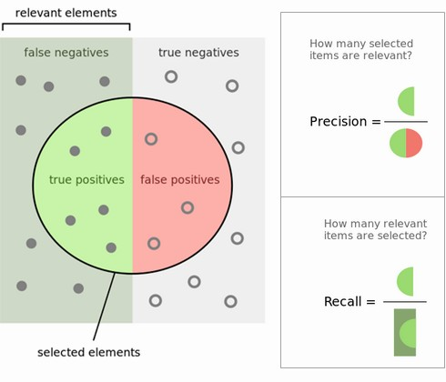

21 Must-Know Data Science Interview Questions and Answers
================
Robert A. Stevens
2021-12-12

<https://www.kdnuggets.com/2016/02/21-data-science-interview-questions-answers.html>

Tags: Bootstrap sampling, Data Science, Interview Questions, Kirk D.
Borne, Precision, Recall, Regularization, Yann LeCun

*KDnuggets Editors bring you the answers to 20 Questions to Detect Fake
Data Scientists, including what is regularization, Data Scientists we
admire, model validation, and more.*

By Gregory Piatetsky, KDnuggets.

The recent post on KDnuggets “20 Questions to Detect Fake Data
Scientists” has been very popular - most viewed in the month of January.

<https://www.kdnuggets.com/2016/01/20-questions-to-detect-fake-data-scientists.html>

However these questions were lacking answers, so KDnuggets Editors got
together and wrote the answers to these questions. I also added one more
critical question - number 21, which was omitted from the 20 questions
post.

Here are the answers. Because of the length, here are the answers to the
first 11 questions, and here is part 2.

<https://www.kdnuggets.com/2016/02/21-data-science-interview-questions-answers-part2.html>

See also the 2017 edition “17 More Must-Know Data Science Interview
Questions and Answers”.

<https://www.kdnuggets.com/2017/02/17-data-science-interview-questions-answers.html>

## Q1. Explain what regularization is and why it is useful.

Answer by Matthew Mayo.

Regularization is the process of adding a tuning parameter to a model to
induce smoothness in order to prevent overfitting.

<https://en.wikipedia.org/wiki/Overfitting>

(see also KDnuggets posts on Overfitting)

<https://www.kdnuggets.com/tag/overfitting>

This is most often done by adding a constant multiple to an existing
weight vector. This constant is often either the L1 (Lasso) or L2
(ridge), but can in actuality can be any norm.

<https://en.wikipedia.org/wiki/Lasso_(statistics)>

<https://en.wikipedia.org/wiki/Tikhonov_regularization>

The model predictions should then minimize the mean of the loss function
calculated on the regularized training set.

Xavier Amatriain presents a good comparison of L1 and L2 regularization
here, for those interested.

<https://www.quora.com/What-is-the-difference-between-L1-and-L2-regularization>

**Fig 1: Lp ball: As the value of p decreases, the size of the
corresponding L-p space also decreases.**

## Q2. Which data scientists do you admire most? which startups?

Answer by Gregory Piatetsky:

This question does not have a correct answer, but here is my personal
list of 12 Data Scientists I most admire, not in any particular order.

Geoff Hinton, Yann LeCun, and Yoshua Bengio - for persevering with
Neural Nets when and starting the current Deep Learning revolution.

Demis Hassabis, for his amazing work on DeepMind, which achieved human
or superhuman performance on Atari games and recently Go.

Jake Porway from DataKind and Rayid Ghani from U. Chicago/DSSG, for
enabling data science contributions to social good.

DJ Patil, First US Chief Data Scientist, for using Data Science to make
US government work better.

Kirk D. Borne for his influence and leadership on social media.

Claudia Perlich for brilliant work on ad ecosystem and serving as a
great KDD-2014 chair.

Hilary Mason for great work at Bitly and inspiring others as a Big Data
Rock Star.

Usama Fayyad, for showing leadership and setting high goals for KDD and
Data Science, which helped inspire me and many thousands of others to do
their best.

Hadley Wickham, for his fantastic work on Data Science and Data
Visualization in R, including dplyr, ggplot2, and Rstudio.

There are too many excellent startups in Data Science area, but I will
not list them here to avoid a conflict of interest.

Here is some of our previous coverage of startups.

<https://www.kdnuggets.com/tag/startups>

## Q3. How would you validate a model you created to generate a predictive model of a quantitative outcome variable using multiple regression.

Answer by Matthew Mayo.

Proposed methods for model validation:

<https://support.sas.com/resources/papers/proceedings12/333-2012.pdf>

-   If the values predicted by the model are far outside of the response
    variable range, this would immediately indicate poor estimation or
    model inaccuracy.

-   If the values seem to be reasonable, examine the parameters; any of
    the following would indicate poor estimation or multi-collinearity:
    opposite signs of expectations, unusually large or small values, or
    observed inconsistency when the model is fed new data.

-   Use the model for prediction by feeding it new data, and use the
    coefficient of determination (R squared) as a model validity
    measure.

<https://en.wikipedia.org/wiki/Coefficient_of_determination>

-   Use data splitting to form a separate dataset for estimating model
    parameters, and another for validating predictions.

-   Use jackknife resampling if the dataset contains a small number of
    instances, and measure validity with R squared and mean squared
    error (MSE).

<https://en.wikipedia.org/wiki/Jackknife_resampling>

<https://en.wikipedia.org/wiki/Mean_squared_error>

## Q4. Explain what precision and recall are. How do they relate to the ROC curve?

Answer by Gregory Piatetsky:

Here is the answer from KDnuggets FAQ: Precision and Recall:

<https://www.kdnuggets.com/faq/precision-recall.html>

Calculating precision and recall is actually quite easy. Imagine there
are 100 positive cases among 10,000 cases. You want to predict which
ones are positive, and you pick 200 to have a better chance of catching
many of the 100 positive cases. You record the IDs of your predictions,
and when you get the actual results you sum up how many times you were
right or wrong. There are four ways of being right or wrong:

1.  True Negative (TN): case was negative and predicted negative

2.  True Positive (TP): case was positive and predicted positive

3.  False Negative (FN): case was positive but predicted negative

4.  False Positive (FP): case was negative but predicted positive

Makes sense so far? Now you count how many of the 10,000 cases fall in
each bucket, say:

|                | Predicted Negative | Predicted Positive |
|----------------|--------------------|--------------------|
| Negative Cases | TN: 9,760          | FP: 140            |
| Positive Cases | FN: 40             | TP: 60             |

Now, your boss asks you three questions:

1.  What percent of your predictions were correct?

You answer: the “accuracy” was (9,760+60) out of 10,000 = 98.2%

2.  What percent of the positive cases did you catch?

You answer: the “recall” was 60 out of 100 = 60%

3.  What percent of positive predictions were correct?

You answer: the “precision” was 60 out of 200 = 30%

See also a very good explanation of Precision and recall in Wikipedia.

<https://en.wikipedia.org/wiki/Precision_and_recall>

**Fig 4: Precision and Recall.**

ROC curve represents a relation between sensitivity (RECALL) and
specificity(NOT PRECISION) and is commonly used to measure the
performance of binary classifiers. However, when dealing with highly
skewed datasets, Precision-Recall (PR) curves give a more representative
picture of performance.

<http://pages.cs.wisc.edu/~jdavis/davisgoadrichcamera2.pdf>

See also this Quora answer: What is the difference between a ROC curve
and a precision-recall curve?.

<https://www.quora.com/What-is-the-difference-between-a-ROC-curve-and-a-precision-recall-curve-When-should-I-use-each>

## Q5. How can you prove that one improvement you’ve brought to an algorithm is really an improvement over not doing anything?

Answer by Anmol Rajpurohit.

Often it is observed that in the pursuit of rapid innovation (aka “quick
fame”), the principles of scientific methodology are violated leading to
misleading innovations, i.e. appealing insights that are confirmed
without rigorous validation. One such scenario is the case that given
the task of improving an algorithm to yield better results, you might
come with several ideas with potential for improvement.

An obvious human urge is to announce these ideas ASAP and ask for their
implementation. When asked for supporting data, often limited results
are shared, which are very likely to be impacted by selection bias
(known or unknown) or a misleading global minima (due to lack of
appropriate variety in test data).

Data scientists do not let their human emotions overrun their logical
reasoning. While the exact approach to prove that one improvement you’ve
brought to an algorithm is really an improvement over not doing anything
would depend on the actual case at hand, there are a few common
guidelines:

-   Ensure that there is no selection bias in test data used for
    performance comparison

-   Ensure that the test data has sufficient variety in order to be
    symbolic of real-life data (helps avoid overfitting)

-   Ensure that “controlled experiment” principles are followed
    i.e. while comparing performance, the test environment (hardware,
    etc.) must be exactly the same while running original algorithm and
    new algorithm

-   Ensure that the results are repeatable with near similar results

-   Examine whether the results reflect local maxima/minima or global
    maxima/minima

One common way to achieve the above guidelines is through A/B testing,
where both the versions of algorithm are kept running on similar
environment for a considerably long time and real-life input data is
randomly split between the two. This approach is particularly common in
Web Analytics.

## Q6. What is root cause analysis?

Answer by Gregory Piatetsky:

According to Wikipedia,

<https://en.wikipedia.org/wiki/Root_cause_analysis>

> Root cause analysis (RCA) is a method of problem solving used for
> identifying the root causes of faults or problems. A factor is
> considered a root cause if removal thereof from the
> problem-fault-sequence prevents the final undesirable event from
> recurring; whereas a causal factor is one that affects an event’s
> outcome, but is not a root cause.

Root cause analysis was initially developed to analyze industrial
accidents, but is now widely used in other areas, such as healthcare,
project management, or software testing.

Here is a useful Root Cause Analysis Toolkit from the state of
Minnesota.

<http://www.health.state.mn.us/patientsafety/toolkit/>

Essentially, you can find the root cause of a problem and show the
relationship of causes by repeatedly asking the question, “Why?”, until
you find the root of the problem. This technique is commonly called “5
Whys”, although is can be involve more or less than 5 questions.

Fig. 5 Whys Analysis Example, from The Art of Root Cause Analysis.

<http://asq.org/quality-progress/2015/02/back-to-basics/the-art-of-root-cause-analysis.html>

## Q7. Are you familiar with price optimization, price elasticity, inventory management, competitive intelligence? Give examples.

Answer by Gregory Piatetsky:

Those are economics terms that are not frequently asked of Data
Scientists but they are useful to know.

Price optimization is the use of mathematical tools to determine how
customers will respond to different prices for its products and services
through different channels.

<https://en.wikipedia.org/wiki/Price_optimization>

Big Data and data mining enables use of personalization for price
optimization. Now companies like Amazon can even take optimization
further and show different prices to different visitors, based on their
history, although there is a strong debate about whether this is fair.

Price elasticity in common usage typically refers to

-   Price elasticity of demand, a measure of price sensitivity. It is
    computed as:

Price Elasticity of Demand = % Change in Quantity Demanded / % Change in
Price

<https://en.wikipedia.org/wiki/Price_elasticity_of_demand>

Similarly, Price elasticity of supply is an economics measure that shows
how the quantity supplied of a good or service responds to a change in
its price.

<https://en.wikipedia.org/wiki/Price_elasticity_of_supply>

Inventory management is the overseeing and controlling of the ordering,
storage and use of components that a company will use in the production
of the items it will sell as well as the overseeing and controlling of
quantities of finished products for sale.

<http://www.investopedia.com/terms/i/inventory-management.asp>

Wikipedia defines

> Competitive intelligence: the action of defining, gathering,
> analyzing, and distributing intelligence about products, customers,
> competitors, and any aspect of the environment needed to support
> executives and managers making strategic decisions for an
> organization.

<https://en.wikipedia.org/wiki/Competitive_intelligence>

Tools like Google Trends, Alexa, Compete, can be used to determine
general trends and analyze your competitors on the web.

Here are useful resources:

-   Competitive Intelligence Metrics, Reports by Avinash Kaushik

<http://www.kaushik.net/avinash/competitive-intelligence-analysis-tools-metrics-reports-techniques/>

-   37 Best Marketing Tools to Spy on Your Competitors from Kissmetrics

<https://blog.kissmetrics.com/james-bond-of-the-web/>

-   10 best competitive intelligence tools from 10 experts

<http://barnraisersllc.com/2014/10/10-best-competitive-intelligence-tools-10-experts/>

## Q8. What is statistical power?

Answer by Gregory Piatetsky:

Wikipedia defines Statistical power or sensitivity of a binary
hypothesis test is the probability that the test correctly rejects the
null hypothesis (H0) when the alternative hypothesis (H1) is true.

<https://en.wikipedia.org/wiki/Statistical_power>

To put in another way, Statistical power is the likelihood that a study
will detect an effect when the effect is present. The higher the
statistical power, the less likely you are to make a Type II error
(concluding there is no effect when, in fact, there is).

<http://effectsizefaq.com/2010/05/31/what-is-statistical-power/>

Here are some tools to calculate statistical power.

<https://www.dssresearch.com/KnowledgeCenter/toolkitcalculators/statisticalpowercalculators.aspx>

## Q9. Explain what resampling methods are and why they are useful. Also explain their limitations.

Answer by Gregory Piatetsky:

Classical statistical parametric tests compare observed statistics to
theoretical sampling distributions. Resampling a data-driven, not
theory-driven methodology which is based upon repeated sampling within
the same sample.

Resampling refers to methods for doing one of these:

-   Estimating the precision of sample statistics (medians, variances,
    percentiles) by using subsets of available data (jackknifing) or
    drawing randomly with replacement from a set of data points
    (bootstrapping)

-   Exchanging labels on data points when performing significance tests
    (permutation tests, also called exact tests, randomization tests, or
    re-randomization tests)

-   Validating models by using random subsets (bootstrapping, cross
    validation)

See more in Wikipedia about bootstrapping, jackknifing.

<https://en.wikipedia.org/wiki/Bootstrapping_(statistics)>

<https://en.wikipedia.org/wiki/Jackknife_(statistics)>

See also How to Check Hypotheses with Bootstrap and Apache Spark

<https://www.kdnuggets.com/2016/01/hypothesis-testing-bootstrap-apache-spark.html>

Here is a good overview of Resampling Statistics.

<http://userwww.sfsu.edu/efc/classes/biol710/boots/rs-boots.htm>

## Q10. Is it better to have too many false positives, or too many false negatives? Explain.

Answer by Devendra Desale.

It depends on the question as well as on the domain for which we are
trying to solve the question.

In medical testing, false negatives may provide a falsely reassuring
message to patients and physicians that disease is absent, when it is
actually present. This sometimes leads to inappropriate or inadequate
treatment of both the patient and their disease. So, it is desired to
have too many false positive.

For spam filtering, a false positive occurs when spam filtering or spam
blocking techniques wrongly classify a legitimate email message as spam
and, as a result, interferes with its delivery. While most anti-spam
tactics can block or filter a high percentage of unwanted emails, doing
so without creating significant false-positive results is a much more
demanding task. So, we prefer too many false negatives over many false
positives.

## Q11. What is selection bias, why is it important and how can you avoid it?

Answer by Matthew Mayo.

Selection bias, in general, is a problematic situation in which error is
introduced due to a non-random population sample. For example, if a
given sample of 100 test cases was made up of a 60/20/15/5 split of 4
classes which actually occurred in relatively equal numbers in the
population, then a given model may make the false assumption that
probability could be the determining predictive factor. Avoiding
non-random samples is the best way to deal with bias; however, when this
is impractical, techniques such as resampling, boosting, and weighting
are strategies which can be introduced to help deal with the situation.

<https://en.wikipedia.org/wiki/Resampling_(statistics)>

<https://en.wikipedia.org/wiki/Boosting_(machine_learning)>

Here is the second part of the answers.

<https://www.kdnuggets.com/2016/02/21-data-science-interview-questions-answers-part2.html>
