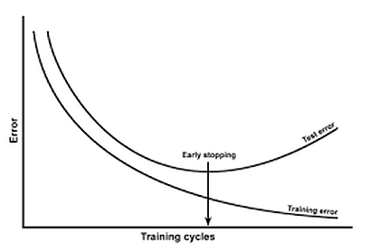
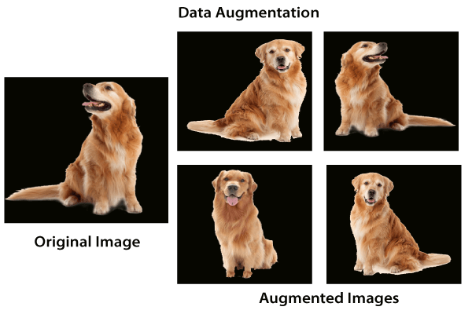
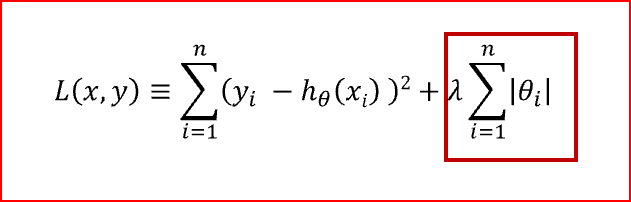
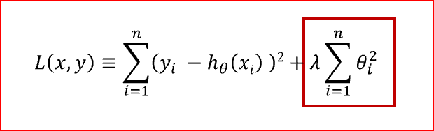
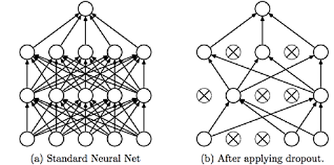

https://www.kdnuggets.com/2019/12/5-techniques-prevent-overfitting-neural-networks.html

Tags: Neural Networks, Overfitting

*In this article, I will present five techniques to prevent overfitting while training neural networks.*

By Abhinav Sagar, VIT Vellore

I have been working on deep learning for more than a year now. In this time period, I have used a lot of neural networks like Convolutional Neural Network, Recurrent Neural Network, Autoencoders etcetera. One of the most common problems that I encountered while training deep neural networks is overfitting.

Overfitting occurs when a model tries to predict a trend in data that is too noisy. This is the caused due to an overly complex model with too many parameters. A model that is overfitted is inaccurate because the trend does not reflect the reality present in the data. This can be judged if the model produces good results on the seen data(training set) but performs poorly on the unseen data(test set). The goal of a machine learning model is to generalize well from the training data to any data from the problem domain. This is very important as we want our model to make predictions in the future on data that it has never seen before.

In this article, I will present five techniques to prevent overfitting while training neural networks.

## 1. Simplifying The Model

The first step when dealing with overfitting is to decrease the complexity of the model. To decrease the complexity, we can simply remove layers or reduce the number of neurons to make the network smaller. While doing this, it is important to calculate the input and output dimensions of the various layers involved in the neural network. There is no general rule on how much to remove or how large your network should be. But, if your neural network is overfitting, try making it smaller.

## 2. Early Stopping
 
Early stopping is a form of regularization while training a model with an iterative method, such as gradient descent. Since all the neural networks learn exclusively by using gradient descent, early stopping is a technique applicable to all the problems. This method update the model so as to make it better fit the training data with each iteration. Up to a point, this improves the model’s performance on data on the test set. Past that point however, improving the model’s fit to the training data leads to increased generalization error. Early stopping rules provide guidance as to how many iterations can be run before the model begins to overfit.

{width=50%}

**Early Stopping**

This technique is shown in the above diagram. As we can see, after some iterations, test error has started to increase while the training error is still decreasing. Hence the model is overfitting. So to combat this, we stop the model at the point when this starts to happen.

## 3. Use Data Augmentation
 
In the case of neural networks, data augmentation simply means increasing size of the data that is increasing the number of images present in the dataset. Some of the popular image augmentation techniques are flipping, translation, rotation, scaling, changing brightness, adding noise, etc. For a more complete reference, checkout `albumentations` and `imgaug`.

https://github.com/albumentations-team/albumentations

https://github.com/aleju/imgaug

{width=100%}

**Data Augmentation**

This technique is shown in the above diagram. As we can see, using data augmentation a lot of similar images can be generated. This helps in increasing the dataset size and thus reduce overfitting. The reason is that, as we add more data, the model is unable to overfit all the samples, and is forced to generalize.

## 4. Use Regularization
 
Regularization is a technique to reduce the complexity of the model. It does so by adding a penalty term to the loss function. The most common techniques are known as L1 and L2 regularization:

- The L1 penalty aims to minimize the absolute value of the weights
    + This is mathematically shown in the below formula

{width=50%}

**L1 Regularization**

- The L2 penalty aims to minimize the squared magnitude of the weights
    + This is mathematically shown in the below formula

{width=50%}

**L2 Regularization**

The below table compares both regularization techniques.

- L1 Regularization
    + Penalizes sum of absolute values of weights
    + Generates model that is simple and interpretable
    + Is robust to outliers

- L2 Regularization
    + Penalizes sum of square values of weights
    + Is able to learn complex data patterns
    + Is not robust to outliers

**L1 vs L2 Regularization**

So which technique is better at avoiding overfitting? The answer is: it depends. If the data is too complex to be modeled accurately then L2 is a better choice as it is able to learn inherent patterns present in the data. While L1 is better if the data is simple enough to be modeled accurately. For most of the computer vision problems that I have encountered, L2 regularization almost always gives better results. However, L1 has an added advantage of being robust to outliers. So the correct choice of regularization depends on the problem that we are trying to solve.

## 5. Use Dropouts
 
Dropout is a regularization technique that prevents neural networks from overfitting. Regularization methods like L1 and L2 reduce overfitting by modifying the cost function. Dropout on the other hand, modify the network itself. It randomly drops neurons from the neural network during training in each iteration. When we drop different sets of neurons, it’s equivalent to training different neural networks. The different networks will overfit in different ways, so the net effect of dropout will be to reduce overfitting.

{width=100%}

**Using Dropouts**

This technique is shown in the above diagram. As we can see, dropouts are used to randomly remove neurons while training of the neural network. This technique has proven to reduce overfitting to a variety of problems involving image classification, image segmentation, word embeddings, semantic matching, etc.

## Conclusion
 
As a quick recap, I explained what overfitting is and why it is a common problem in neural networks. I followed it up by presenting five of the most common ways to prevent overfitting while training neural networks:

1. simplifying the model

2. early stopping

3. data augmentation

4. regularization

5. dropouts

## References/Further Readings
 
- Why dropouts prevent overfitting in Deep Neural Networks
    + Here I will illustrate the effectiveness of dropout layers with a simple example

https://vivek-yadav.medium.com/why-dropouts-prevent-overfitting-in-deep-neural-networks-937e2543a701

- A comparison of methods to avoid overfitting in neural networks training in the case of catchment…
    + Artificial neural networks (ANNs) becomes very popular tool in hydrology, especially in rainfall-runoff modelling…

https://www.sciencedirect.com/science/article/abs/pii/S0022169412008931

- How to Avoid Overfitting in Deep Learning Neural Networks
    + Training a deep neural network that can generalize well to new data is a challenging problem

https://machinelearningmastery.com/introduction-to-regularization-to-reduce-overfitting-and-improve-generalization-error/

- Deep neural networks: preventing overfitting
    + In previous posts, I've introduced the concept of neural networks and discussed how we can train neural networks

https://www.jeremyjordan.me/deep-neural-networks-preventing-overfitting

- aleju/imgaug
     + This python library helps you with augmenting images for your machine learning projects

https://github.com/aleju/imgaug

## Contacts
 
If you want to keep updated with my latest articles and projects follow me on Medium. These are some of my contacts details:

- Linkedin

https://in.linkedin.com/in/abhinavsagar4

- Medium Profile

https://medium.com/@abhinav.sagar

- GitHub

https://github.com/abhinavsagar

- Kaggle

https://www.kaggle.com/abhinavsagar

- Personal Website

https://abhinavsagar.github.io/

Happy reading, happy learning, and happy coding!

Bio: Abhinav Sagar is a senior year undergrad at VIT Vellore. He is interested in data science, machine learning and their applications to real-world problems.

Original. Reposted with permission.

https://towardsdatascience.com/5-techniques-to-prevent-overfitting-in-neural-networks-e05e64f9f07

## Related:

- Deep Learning for Image Classification with Less Data

https://www.kdnuggets.com/2019/11/deep-learning-image-classification-less-data.html

- How to Easily Deploy Machine Learning Models Using Flask

https://www.kdnuggets.com/2019/10/easily-deploy-machine-learning-models-using-flask.html

- Introduction to Artificial Neural Networks

https://www.kdnuggets.com/2019/10/introduction-artificial-neural-networks.html
