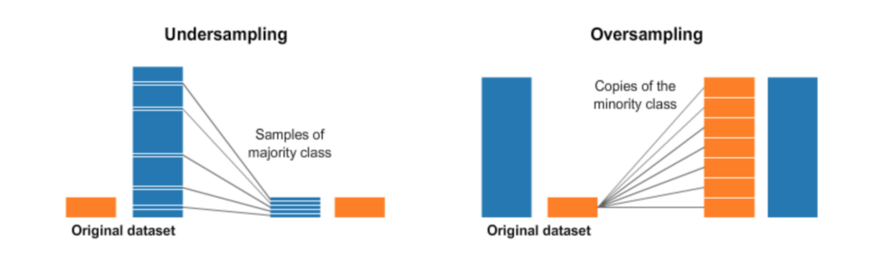
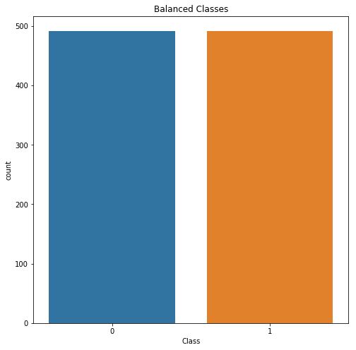
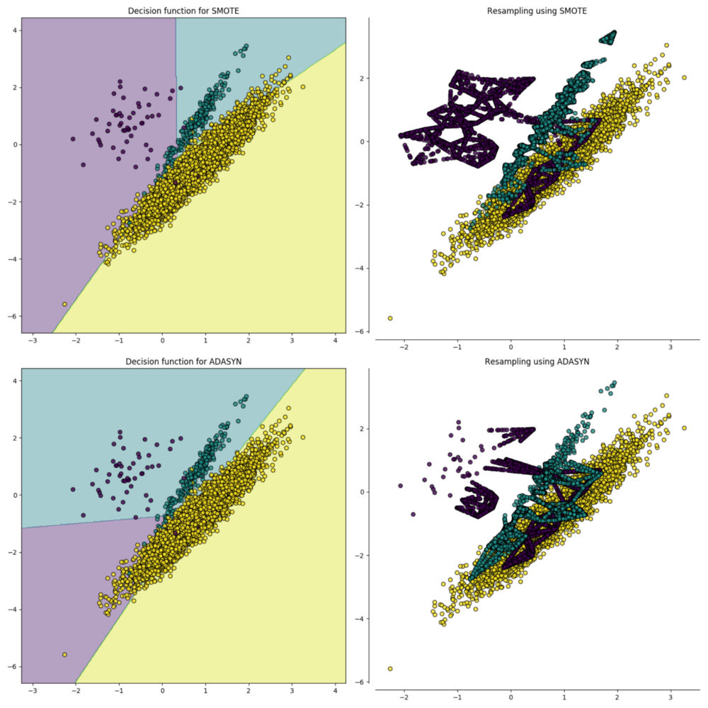
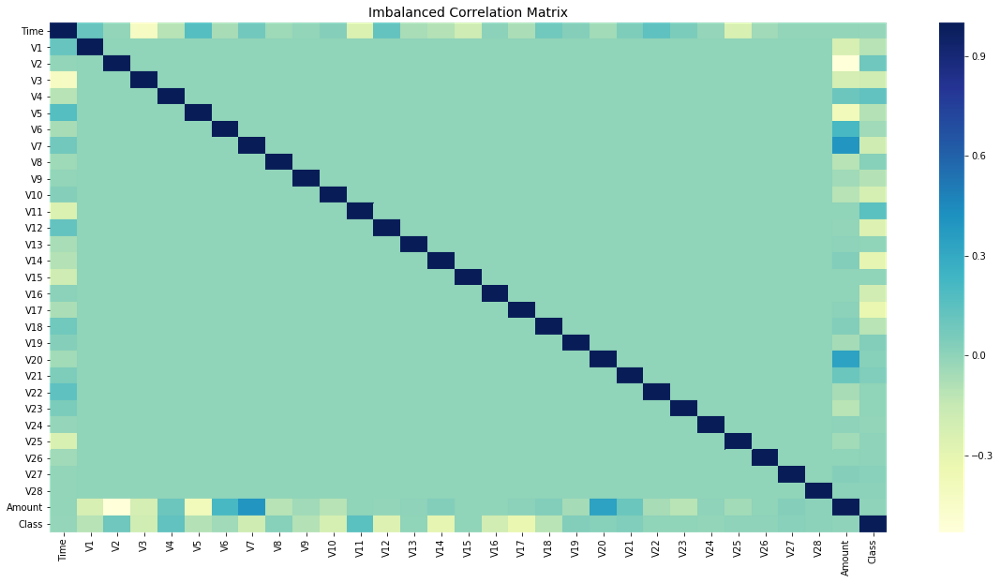
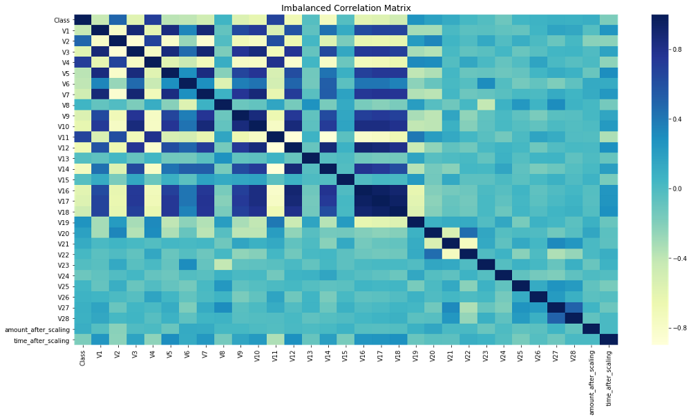

https://www.kdnuggets.com/2019/05/fix-unbalanced-dataset.html

Tags: Balancing Classes, Data Preparation, Machine Learning, Unbalanced

*We explain several alternative ways to handle imbalanced datasets, including different resampling and ensembling methods with code examples.*

By Will Badr, Amazon Web Services.

Classification is one of the most common machine learning problems. The best way to approach any classification problem is to start by analyzing and exploring the dataset in what we call Exploratory Data Analysis (EDA). The sole purpose of this exercise is to generate as many insights and information about the data as possible. It is also used to find any problems that might exist in the dataset. One of the common issues found in datasets that are used for classification is imbalanced classes issue.

## What Is Data Imbalance?

Data imbalance usually reflects an unequal distribution of classes within a dataset. For example, in a credit card fraud detection dataset, most of the credit card transactions are not fraud and a very few classes are fraud transactions. This leaves us with something like 50:1 ratio between the fraud and non-fraud classes. In this article, I will use the credit card fraud transactions dataset from Kaggle which can be downloaded from here:

https://www.kaggle.com/mlg-ulb/creditcardfraud

First, let’s plot the class distribution to see the imbalance.

{width=50%}

As you can see, the non-fraud transactions far outweigh the fraud transactions. If we train a binary classification model without fixing this problem, the model will be completely biased. It also impacts the correlations between features and I will show you how and why later on.

Now, let’s cover a few techniques to solve the class imbalance problem. A notebook with the complete code can be found HERE:

https://github.com/wmlba/innovate2019/blob/master/Credit_Card_Fraud_Detection.ipynb

{width=100%}

## 1 - Resampling (Oversampling and Undersampling)**

This is as intuitive as it sounds. Undersampling is the process where you randomly delete some of the observations from the majority class in order to match the numbers with the minority class. An easy way to do that is shown in the code below:

```
# Shuffle the Dataset.
shuffled_df = credit_df.sample(frac=1,random_state=4)

# Put all the fraud class in a separate dataset.
fraud_df = shuffled_df.loc[shuffled_df['Class'] == 1]

# Randomly select 492 observations from the non-fraud (majority class)
non_fraud_df = shuffled_df.loc[shuffled_df['Class'] == 0].sample(n=492,random_state=42)

# Concatenate both dataframes again
normalized_df = pd.concat([fraud_df, non_fraud_df])

# plot the dataset after the undersampling
plt.figure(figsize=(8, 8))
sns.countplot('Class', data=normalized_df)
plt.title('Balanced Classes')
plt.show()
```

After undersampling the dataset, I plot it again and it shows an equal number of classes:

{width=50%}

**Balanced Dataset (Undersampling)**

The second resampling technique is called, Oversampling. This process is a little more complicated than undersampling. It is the process of generating synthetic data that tries to randomly generate a sample of the attributes from observations in the minority class. There are a number of methods used to oversample a dataset for a typical classification problem. The most common technique is called SMOTE (Synthetic Minority Over-sampling Technique). In simple terms, it looks at the feature space for the minority class data points and considers its k nearest neighbours.

{width=100%}

Source: https://imbalanced-learn.readthedocs.io/en/stable/over_sampling.html

To code this in python, I use a library called imbalanced-learn or imblearn. 

https://imbalanced-learn.readthedocs.io/en/stable/index.html

The code below shows how to implement SMOTE.

```
from imblearn.over_sampling import SMOTE

# Resample the minority class. You can change the strategy to 'auto' if you are not sure.
sm = SMOTE(sampling_strategy='minority', random_state=7)

# Fit the model to generate the data.
oversampled_trainX, oversampled_trainY = sm.fit_sample(
    credit_df.drop('Class', axis=1), 
    credit_df['Class']
)
oversampled_train = pd.concat(
    [pd.DataFrame(oversampled_trainY), pd.DataFrame(oversampled_trainX)], 
    axis=1
)
oversampled_train.columns = normalized_df.columns
```

Remember when I said how imbalanced data would affect the feature correlation? Let me show you the correlation before and after treating the imbalanced class.

### Before Resampling:

The code below plots the correlation matrix between all the features.

```
# Sample figsize in inches
fig, ax = plt.subplots(figsize=(20,10))

# Imbalanced DataFrame Correlation
corr = credit_df.corr()
sns.heatmap(corr, cmap='YlGnBu', annot_kws={'size':30}, ax=ax)
ax.set_title("Imbalanced Correlation Matrix", fontsize=14)
plt.show()
```

{width=100%}

### After Resampling:

{width=100%}

Notice that the feature correlation is much more obvious now. Before fixing the imbalance problem, most of the features did not show any correlation which would definitely have impacted the performance of the model. Since the feature correlation really matters to the overall model’s performance, it is important to fix the imbalance as it will also impact the ML model performance.

https://towardsdatascience.com/why-feature-correlation-matters-a-lot-847e8ba439c4

## 2 - Ensembling Methods (Ensemble of Sampler):

In Machine Learning, ensemble methods use multiple learning algorithms and techniques to obtain better performance than what could be obtained from any of the constituent learning algorithms alone. (Yes, just like a democratic voting system). When using ensemble classifiers, bagging methods become popular and it works by building multiple estimators on a different randomly selected subset of data. In the scikit-learn library, there is an ensemble classifier namedBaggingClassifier. However, this classifier does not allow to balance each subset of data. Therefore, when training on imbalanced data set, this classifier will favour the majority classes and create a biased model.

In order to fix this, we can use `BalancedBaggingClassifier` from `imblearn` library. It allows the resampling of each subset of the dataset before training each estimator of the ensemble. 

https://imbalanced-learn.readthedocs.io/en/stable/generated/imblearn.ensemble.BalancedBaggingClassifier.html#imblearn.ensemble.BalancedBaggingClassifier

Therefore, `BalancedBaggingClassifier` takes the same parameters as the `scikit-learn` `BaggingClassifier` in addition to two other parameters, sampling_strategy and replacement which control the behaviour of the random sampler. Here is some code that shows how to do this:

```
from imblearn.ensemble import BalancedBaggingClassifier
from sklearn.tree import DecisionTreeClassifier

# Create an object of the classifier.
bbc = BalancedBaggingClassifier(
    base_estimator=DecisionTreeClassifier(),
    sampling_strategy='auto',
    replacement=False,
    random_state=0
)

y_train = credit_df['Class']
X_train = credit_df.drop(['Class'], axis=1, inplace=False)

# Train the classifier.
bbc.fit(X_train, y_train)
preds = bbc.predict(X_test)
```

That way, you can train a classifier that will handle the imbalance without having to undersample or oversample manually before training.

In Conclusion, everyone should know that the overall performance of ML models built on imbalanced datasets, will be constrained by its ability to predict rare and minority points. Identifying and resolving the imbalance of those points is crucial to the quality and performance of the generated models.

Original - reposted with permission:

https://towardsdatascience.com/having-an-imbalanced-dataset-here-is-how-you-can-solve-it-1640568947eb

Bio: Will Badr is an experienced Senior Technical Account Manager with a demonstrated history of working in the information technology and services industry. Focusing on the Artificial Intelligence and Machine Learning Profile and spreading the innovation culture.

## Resources:

- On-line and web-based: Analytics, Data Mining, Data Science, Machine Learning education

https://www.kdnuggets.com/education/online.html

- Software for Analytics, Data Science, Data Mining, and Machine Learning

https://www.kdnuggets.com/software/index.html

## Related:

- Top R Packages for Data Cleaning

https://www.kdnuggets.com/2019/05/fix-unbalanced-dataset.html#:~:text=Top%20R%20Packages%20for%20Data%20Cleaning

- Preparing for the Unexpected

https://www.kdnuggets.com/2019/02/preparing-unexpected.html

- Acquiring Labeled Data to Train Your Models at Low Costs

https://www.kdnuggets.com/2019/02/labeled-data-train-models.html
